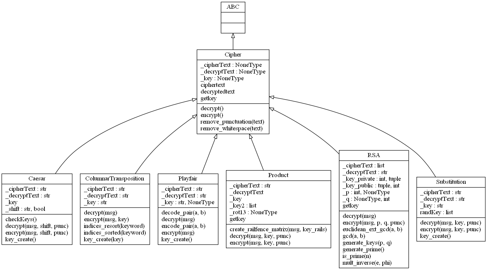

# Python Cryptography

Implements:
- Substitution Cipher
- Playfair Cipher
- Caesar Cipher
- Columnar Transposition Cipher
- Product Cipher
- RSA Cipher

---
### UML Class Diagram

Last Modified: 31/03/2023
